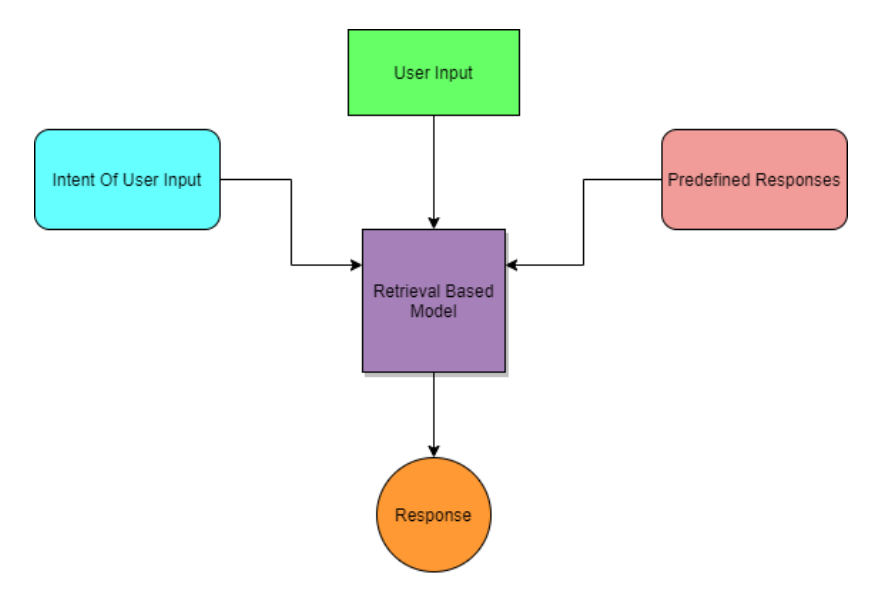

## McMaster student-services chatbot

CLI Chatbot used to assist McMaster students with frequently asked questions. Utilizing Neural Networks (DNN) and a Retrieval-Based Model for fetching the highest predicted response.

### Tech stack:
```
python3.6 | TensorFlow | NLTK | numpy
```

### Install from requirements
```
python3 -m pip install -r requirements.txt
```

### Run chatbot 
```
python3 -m chatbot
```
*Start asking questions! i.e. 'How can I get my transcript?', 'How can I apply for OSAP?'*


### How it works
The chatbot utilizes a retrieval-based model. A retrieval model uses a predefined set of responses to send to the end-user.
To train the bot, an 'intent, pattern, response' data-set was used. Each intent contains a range of different patterns and a number of predetermined responses.
The patterns are used to predict the users intent, and the response is a suitable response supplied to the user.

**Note: `class` represents the users intent**
```json
{
  "class": "greeting",
  "patterns": [
    "Hi",
    "Hello",
    "Good day",
    "Whats up",
    "Hey"
  ],
  "responses": [
    "Hello! Welcome to McMaster Student Services",
    "Hey, Welcome to McMaster Student Services. What can I help you with?",
    "Hi there.  Welcome to McMaster Student Services. How can I help?"
  ]
}
```
<br/>




